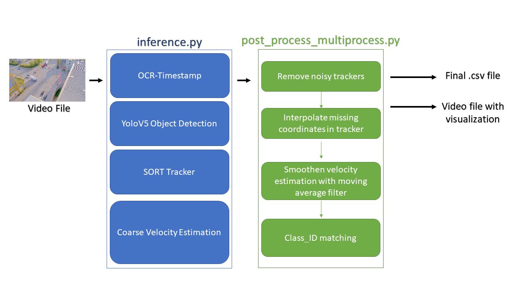

# Traffic_Camera_Tracking: Technical Guide

## Overview
---
 

Mainly consists of two files [inference.py](../inference.py) and [post_process_multiProcess.py](../post_process_multiProcess.py)

### Inference.py
Takes in video file, weights of trained YoloV5 network and output directory For every frame of the video file: 
* Runs OCR (optical character recognition) to detect date-timestamp from corner of the image
* Uses YoloV5 to detect the VRU's
* Runs SORT tracker on detection to track VRU's across multiple frames
* Using predefined calibration matrix, determines the world projection of the bboxes and calculates velocity by comparing by world projection in subsequent frames

After processing all the frames, data is passed on for post processing (if required, post processing could be skipped and direct inference results can be visualized)

### post_process_multiProcess.py
Takes in data from inference.py as pandas Dataframe and :
* Removes noisy trackers (tracker with only instances) and rearranges the tracker ID's
* Interpolation: Depending on how good the detection is tracker can disappear for few frames and reappear again. Using quadratic interpolation, the missing coordinates of the tracker are filled in between
* Velocity estimation: Velocity estimation done during inference is quite rough and can fluctuate a lot. In this function, a moving average filter is applied to smoothen out the velocity values
* Class_ID_matching: Tracker only associate whether they are same VRU or not and to detect what class of VRU's, the class_ID from YoloV5 are used. But these class_ID are not always constant. So, using standard deviation and certain speed threshold, the class_ID for a tracker is determined and applied to the entire tracker
* Save_angle: Saves angle and heading direction for each tracker
* Save_VRU_count: Saves number of instance of each class of VRU

### VRU Classes supported (same order is used in the code as well):  
1. Escooter
2. Pedestrian
3. Cyclist
4. Motorcycle
5. Car
6. Truck
7. Bus

## Notes
---
* All important internal configuration parameters are stored in [main_param.yaml](../configs/main_param.yaml). **DO NOT CHANGE UNLESS ABSOLUTELY REQUIRED !!**
* Highly recommended to use 1920x1080 video and strictly at 30 fps. Many internal operations like OCR and velocity estimation depend on this
* For every change in camera angle/rotation/zoom level, re-calibration is required